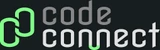
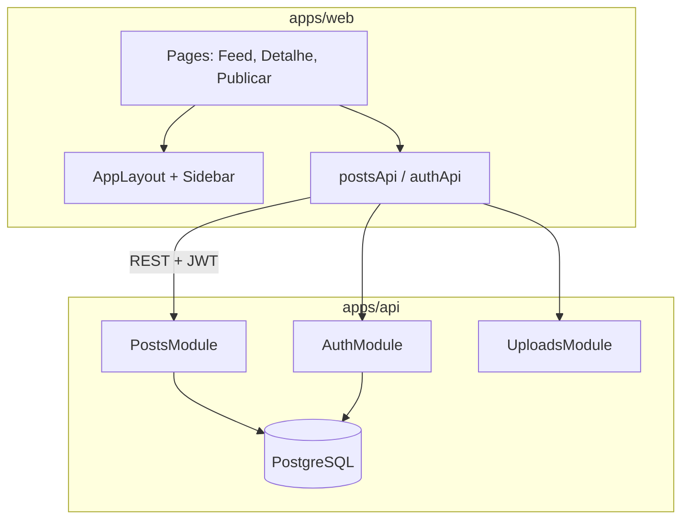

# Code Connect

Rede social para desenvolvedores compartilharem projetos, código e ideias. Monorepo com frontend React e API REST NestJS, autenticação JWT e feed de posts com busca full-text.

<p align="center">
  
</p>

## Stack

| Camada | Tecnologias |
|--------|-------------|
| **Frontend** | React 19, Vite 8, TypeScript, Tailwind CSS, React Router, Axios |
| **Backend** | NestJS 11, TypeORM, PostgreSQL 16, Passport JWT, Swagger |
| **Infra local** | Docker Compose, pnpm workspaces |

## Arquitetura



## Funcionalidades

- **Feed público** — qualquer pessoa pode ver posts, filtrar e buscar
- **Detalhe do post** — thumbnail, descrição, bloco de código e comentários
- **Autenticação** — cadastro, login com JWT e sessão persistente
- **Interações** — usuários logados podem publicar, curtir e comentar
- **Busca full-text** — filtros por termos no backend (PostgreSQL `tsvector`)
- **Upload de thumbnail** — imagens servidas em `/uploads`

## Pré-requisitos

- [Node.js](https://nodejs.org/) 20+
- [pnpm](https://pnpm.io/) 9+
- [Docker](https://www.docker.com/) (para PostgreSQL)

## Como executar

### 1. Clonar e instalar dependências

```bash
git clone https://github.com/jeffersonmello8/code-connect.git
cd code-connect
pnpm install
```

### 2. Subir o banco de dados

```bash
docker compose up -d
```

O PostgreSQL ficará disponível em `localhost:5432` com:

| Variável | Valor |
|----------|-------|
| Usuário | `codeconnect` |
| Senha | `codeconnect` |
| Banco | `codeconnect` |

### 3. Configurar variáveis de ambiente

Crie `apps/api/.env`:

```env
DATABASE_HOST=localhost
DATABASE_PORT=5432
DATABASE_USER=codeconnect
DATABASE_PASSWORD=codeconnect
DATABASE_NAME=codeconnect
PORT=3000
JWT_SECRET=troque-em-producao
```

Opcionalmente, crie `apps/web/.env` se a API não estiver em `localhost:3000`:

```env
VITE_API_URL=http://localhost:3000
```

### 4. Migrations e dados de demonstração

```bash
cd apps/api
pnpm migration:run
pnpm seed
```

### 5. Iniciar os apps

Em terminais separados, na raiz do monorepo:

```bash
pnpm dev:api   # API em http://localhost:3000
pnpm dev:web   # Frontend em http://localhost:5173
```

Documentação interativa da API: [http://localhost:3000/api](http://localhost:3000/api)

## Contas de demonstração

Após o seed, use qualquer uma das contas abaixo (senha: `senha123`):

| E-mail | Nome |
|--------|------|
| `julio@codeconnect.dev` | Julio Santos |
| `marcia@codeconnect.dev` | Marcia Oliveira |
| `gabriel@codeconnect.dev` | Gabriel Luz |

## Rotas do frontend

| Rota | Acesso | Descrição |
|------|--------|-----------|
| `/` | Público | Feed de posts com busca e filtros |
| `/posts/:id` | Público | Detalhe do post e comentários |
| `/posts/new` | Autenticado | Publicar novo projeto |
| `/login` | Visitante | Entrar na conta |
| `/register` | Visitante | Criar conta |

## API — principais endpoints

| Método | Rota | Auth | Descrição |
|--------|------|------|-----------|
| `POST` | `/users` | — | Cadastro |
| `POST` | `/auth/login` | — | Login (retorna JWT) |
| `GET` | `/auth/me` | JWT | Perfil do usuário logado |
| `GET` | `/posts?q=&sort=` | Opcional | Listar posts (FTS + paginação) |
| `GET` | `/posts/:id` | Opcional | Detalhe com comentários |
| `POST` | `/posts` | JWT | Criar post |
| `POST` | `/posts/:id/likes` | JWT | Curtir |
| `DELETE` | `/posts/:id/likes` | JWT | Remover curtida |
| `POST` | `/posts/:id/comments` | JWT | Comentar ou responder |
| `POST` | `/uploads` | JWT | Upload de thumbnail |

Query params do feed: `q` (busca), `page`, `limit`, `sort=recent|popular`.

## Scripts do monorepo

```bash
pnpm dev:web          # Frontend (Vite)
pnpm dev:api          # Backend (watch)
pnpm build:web        # Build de produção do frontend
pnpm build:api        # Build de produção da API
pnpm lint:web         # Oxlint
pnpm lint:api         # ESLint
pnpm test:web         # Testes Vitest
```

Scripts adicionais da API (`apps/api`):

```bash
pnpm migration:run    # Aplicar migrations
pnpm migration:revert # Reverter última migration
pnpm seed             # Popular banco com dados mock
pnpm test             # Testes unitários
pnpm test:e2e         # Testes end-to-end
```

## Estrutura do projeto

```
code-connect/
├── apps/
│   ├── api/                 # NestJS — REST API
│   │   ├── src/posts/       # Domínio de posts, likes e comments
│   │   ├── src/auth/        # JWT e guards
│   │   ├── src/database/    # Migrations e seed
│   │   └── uploads/         # Arquivos enviados (gitignored)
│   └── web/                 # React — interface
│       └── src/
│           ├── components/  # Atomic Design (atoms → templates)
│           ├── pages/       # Feed, detalhe, login, cadastro
│           └── lib/api/     # Cliente HTTP
├── docker-compose.yml       # PostgreSQL local
└── pnpm-workspace.yaml
```

## Testes

```bash
# Frontend — componentes e acessibilidade
pnpm test:web
pnpm test:a11y

# Backend
pnpm --filter api test
pnpm --filter api test:e2e
```

## Convenções

- **Commits**: [Conventional Commits](https://www.conventionalcommits.org/) (`feat(web):`, `feat(api):`, `docs:`)
- **Frontend**: Atomic Design, Tailwind, testes colocalizados por componente
- **Backend**: REST sem verbos na URL, DTOs com `class-validator`, specs colocalizados

Mais detalhes em [`AGENTS.md`](AGENTS.md), [`apps/web/AGENTS.md`](apps/web/AGENTS.md) e [`apps/api/AGENTS.md`](apps/api/AGENTS.md).

---

<p align="center">
  Feito com ☕ para a comunidade dev
</p>
